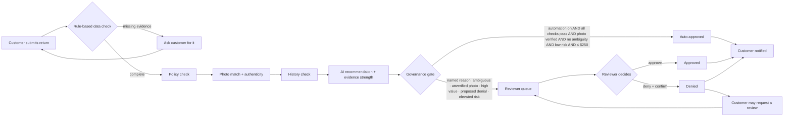
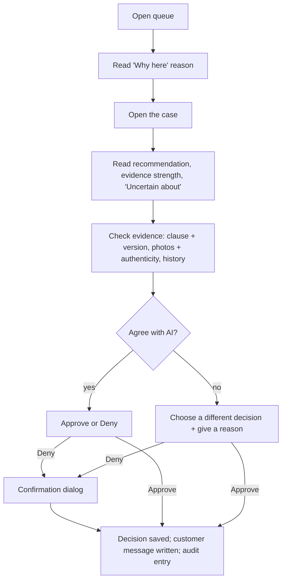

# ReturnGuard — Design Specification

> **Status: v1 (after evidence).** v0 was drafted from the concept alone. v1 revises it
> using the prompting study (24 runs across ChatGPT, Claude, Gemini, and Qwen), eight
> speed-dating interviews (four customers, four retail, support, or returns staff), and the
> theory lens (Gonzalez et al., 2026). Interviews are cited by member and interviewee — e.g.
> *Trupti P2* is Trupti's reviewer-like interviewee. Every feature is
> traced to `validation/OPPORTUNITY_FRAMING.md` (feature IDs M1–M8, S1–S5, C1–C3) — no
> orphan features. Section 1 lists what changed from v0 and why.

---

## 1. What changed from v0 — and why

| v0 design | Evidence | v1 design | Feature |
|---|---|---|---|
| The case page showed the model's own confidence ("Medium, 62%") | Tools said 95–100% on wrong answers (E1, F1, F2). **7 of 7** interviewees asked distrusted a bare score: *"Claiming 100% makes me wonder whether the AI understands its own limitations"* (Aditya P1); *"Percentages can make people lazy and trick them into hitting 'approve' without actually looking"* (Avni P2). | **Evidence strength computed from the checks** (Strong / Mixed / Weak) plus an **"Uncertain about"** list. No model self-rated percentage anywhere | M3 |
| Photo check was one "signal only" line | 0 of 4 tools detected the AI-generated photo; Gemini approved its own fake at 100% (F1). **3 of 3** reviewer-like interviewees asked already check lighting, "too perfect" photos, metadata, or reverse image search (Aditya P2, Sharayu P2, Trupti P2) | A separate **photo authenticity** check with an explicit **"Not verified"** state. An unverified damage photo can never be auto-approved | M5 |
| Incomplete returns went to the reviewer queue | Claude and Gemini *denied* a claim with no photo (F2). Customer: *"Tell me what's missing, not just that I'm wrong"* (Trupti P1) | A **rule-based data check runs before any AI**. Missing evidence goes back to the **customer** ("We need a photo"), not to a decision or a reviewer | M6 |
| Escalated anything below a confidence threshold | *"The system should filter cases intelligently rather than just passing its uncertainty to employees"* (Aditya P2); *"If everything is 'needs review' in December, I'm back to doing it all by hand"* (Trupti P2) | The gate escalates only for **named reasons** — ambiguous call, unverified photo, high value, proposed denial, elevated risk — shown in the queue | M2 |
| No special handling for judgment calls | 3 of 4 tools denied the wear-vs-defect case at 70–100% (E1). **3 of 3** reviewer-like interviewees asked trust AI on obvious damage, not wear vs. defect; *"High confidence shouldn't override obvious ambiguity"* (Aditya P2) | An **ambiguity flag**: when policy hinges on judgment (P2 defect vs. P3 wear), the gate always escalates and the case page says so first | M4 |
| Customers could not challenge a decision (appeals out of scope) | **4 of 4** customers had a return outcome that felt unexplained or weakly evidenced; *"There should be an easy way for customers to appeal"* (Aditya P1) | **"Request a review"** on a denied return, with a short explanation, routed back to the reviewer queue | S2 |
| Agreement rate was one overall number | Three reviewer-like interviewees asked for override tracking — *"those overrides could reveal where the AI isn't working well"* (Aditya P2; also Sharayu P2, Trupti P2) | Agreement and overrides **broken down by product type and escalation reason**; escalation rate shown to the admin | S1 |
| Denials needed a reviewer | All 4 tools failed to require human sign-off (F3) — ChatGPT: *"no manager approval… is needed."* **7 of 8** interviewees said a person must make denials | **Confirmed and strengthened:** the gate structurally cannot deny, and the customer's denial message is written only after a reviewer confirms | M1 |
| Policy clause and version shown with findings | Customers and reviewers asked for *"the exact policy rule"* (Aditya P1, P2; Sharayu P1); Gemini invented an approval rule (F3) | **Confirmed:** every finding cites its clause and policy version | M7 |
| No bias handling | Claude assumed a customer's gender from their name (F2); a customer raised profiling of "high-risk" customers, unprompted (Sharayu P1) | **Bias safeguards:** names and gendered cues removed from model inputs; behavior risk audited for disparate impact | M8 |
| The case page showed findings, but not where in the photo they came from | *"Show me where to look — I'll tell you if it's right"* (Trupti P2); fast recommendations turn reviewers into *"validators"* (Sharayu P2) | **Show the reviewer where to look:** the photo area behind each finding is highlighted, and disagreeing is one click with a predefined reason | S5 |

---

## 2. What the product does

A customer returns an item through an online shop. A **rule-based data check** first makes
sure the request is complete. AI then checks the return against the store's policy, the
photo (including whether it looks genuine), and the customer's history, and writes a
recommendation. A **governance gate** decides what happens next: only clear, low-risk,
low-value cases with verified evidence are approved automatically. Everything else goes to a
human reviewer **for a named reason** — and **every denial is made by a person**.

**Division of labour** (from `validation/THEORY_LENS.md`):

| | AI owns | Humans own |
|---|---|---|
| Reasoning | Applying clear policy rules consistently (windows, required evidence, value limits); a written rationale for every case | Ambiguous policy calls (wear vs. defect); every denial; fairness and accountability |
| Memory | Retrieving the exact policy clause, its version, and the customer's history, with sources | Validating that evidence applies and is genuine; knowing the store's real process |
| Attention | Checking every return, field, and photo, instantly | Exceptions the gate names, and cues that "feel off" (a photo that looks too perfect) |
| Meta-coordination | Routing cases by fixed, named rules; logging every step | Setting the rules and limits; switching automation on or off; reviewing customer requests |

---

## 3. Personas and mental models

### P1 — Maya, the customer
*Informed by the four customer interviews: all four had a return outcome that felt
unexplained or weakly evidenced, and three were questioned or refused for "signs of use /
wear" with little evidence.*
- **Goal:** a fair refund, without wondering what happens next.
- **Mental model:** "A store employee checks my return." Distrusts automated certainty:
  *"Nobody is 100% sure about a photo"* (Trupti P1).
- **Decision rights:** none over the outcome — but can **request a review** of a denial.
- **Interrogation moments:** when a decision arrives (*why?*), and when it feels unfair
  (*can someone look again?*).
- **Trust cues needed:** a clear status; the exact policy rule and the evidence considered;
  **who decided** — automatically or a person; for denials, a way to ask for a review. Would
  rather wait a day or two for a person than get a fast, wrong answer — *"I can wait if I
  know someone is actually looking at it"* (Trupti P1).

### P2 — Riley, the Trust & Safety reviewer
*Informed by the four reviewer-like interviews (retail, support, warehouse, and bookstore
returns staff): a case takes 1–15 minutes, longest when judging wear vs. defect; in two of
their workplaces, condition-based denials already need a lead's approval.*
- **Goal:** clear the queue without approving fraud or wrongly denying an honest customer —
  and without being flooded by cases the system should have handled.
- **Mental model:** "The AI is a recommendation, not the final judge." Ignores percentages
  without meaning; looks first at the return reason, the photos, and the history. Will only
  sign what they actually checked: *"If my name is on the denial, I need to have actually
  looked"* (Trupti P2).
- **Decision rights:** **final sign-off on every escalated case and every denial.** Can
  agree with or override the AI (with a reason).
- **Interrogation moments:** reading *why* the case is here; checking the cited clause;
  comparing photos and judging authenticity; disagreeing with the AI.
- **Trust cues needed:** the recommendation, its reason, and what the AI is unsure about —
  readable **in under a minute**; **where in the photo to look**; a clear warning when a photo
  is unverified; and a fast way to disagree, so validating never becomes rubber-stamping.

### P3 — Priya, the risk / platform admin
- **Goal:** keep decisions consistent, policy-compliant, and auditable.
- **Mental model:** "The AI is a junior analyst on probation — it earns autonomy with
  evidence."
- **Decision rights:** turns automation on or off; sets the risk limit and high-value limit.
  Cannot change the "AI never denies" rule or the "unverified photos never auto-approve"
  rule.
- **Interrogation moment:** where does the AI disagree with reviewers, and is the gate
  sending too many cases to people?
- **Trust cues needed:** agreement and overrides by product type and reason; escalation
  rate; a complete audit trail.

### Decision rights summary

| Decision | AI | Reviewer | Admin | Customer |
|---|---|---|---|---|
| Recommend approve / deny / escalate | ✅ | — | — | — |
| Auto-approve (automation on, all checks pass, photo verified, no ambiguity, low risk, ≤ $250) | ✅ | — | — | — |
| Approve an escalated case | — | ✅ | ✅ | — |
| Deny any case | ❌ never | ✅ with confirmation | ✅ with confirmation | — |
| Request a review of a denial | — | — | — | ✅ |
| Turn automation on / off, set risk and value limits | — | — | ✅ | — |
| Change the fixed rules (AI never denies; unverified photos never auto-approve) | — | — | ❌ fixed | — |

---

## 4. User journeys and task flows

### 4.1 End-to-end flow



### 4.2 Customer journey — Maya

| Stage | Maya does | Maya sees | Design intent | Feature |
|---|---|---|---|---|
| 1. Shop | Browses, adds sneakers to cart, checks out with a test card | Order confirmation | Realistic context for the return | — |
| 2. Start return | Opens the order → **Return item** → reason, note, photo | A photo field appears only when the reason needs one | Prevent incomplete requests | M6 |
| 3. Missing evidence (if any) | Uploads what's asked | "We need a photo of the damage to continue" | Never decide on missing evidence | M6 |
| 4. Wait | — | *Submitted → Being checked → Under review* | Visible progress | — |
| 5. Outcome | Reads the decision | Plain-English reason, the policy rule, and the evidence considered; denials say "Reviewed by a member of our team" | Trust calibration; accountability | S3, M1, M7 |
| 6. Disagree (if denied) | **Request a review** → adds an explanation | "A reviewer will look at your case again" | A way to challenge a decision | S2 |

### 4.3 Reviewer task flow — Riley



### 4.4 Admin task flow — Priya
1. Open **Settings** → automation status, risk and value limits, the fixed rules, and the
   **escalation rate**.
2. Read **agreement by product type and reason** → decide whether automation should be on.
3. Change a setting → **Save** → recorded in the audit log.
4. Open **Audit log** → filter by case → every check, the gate's reason, and every human
   action in order.

---

## 5. Screens and wireframes

### 5.1 Customer — Start a return

```
┌──────────────────────────────────────────────────────────┐
│ ShopCo                                    Orders  Cart   │
├──────────────────────────────────────────────────────────┤
│ Return an item — Order #1042                             │
│                                                          │
│ [img] Classic White Leather Sneakers   $89   Delivered   │
│                                              20 Sep 2026 │
│ Reason        [ Damaged / defective          ▼ ]         │
│ Tell us more  [ The sole started peeling away...     ]   │
│                                                          │
│ Photo (required for damaged items)                       │
│ [  Upload a photo  ]                                     │
│                                                          │
│ Refund: $89.00 to the original payment method            │
│                                    [ Submit return ]     │
└──────────────────────────────────────────────────────────┘
```

- The photo field appears only for reasons that need it; Submit stays disabled until
  required fields are complete (M6).

### 5.2 Customer — Return status and outcome

```
┌──────────────────────────────────────────────────────────┐
│ Return #R-211 — Running Shorts · $35                     │
│                                                          │
│  ● Submitted ── ● Being checked ── ● Under review ── ● Done
│                                                          │
│ ✕ Your return was not approved.                          │
│   Policy rule: P1 — items may be returned up to day 30.  │
│   We considered: delivered 15 Aug (day 47) · reason      │
│   "Changed my mind" · item marked unused.                │
│   This decision was reviewed by a member of our team.    │
│                                                          │
│ Think we got it wrong?    [ Request a review ]           │
└──────────────────────────────────────────────────────────┘
```

- The outcome names the **policy rule** and the **evidence considered** (S3, M7), and says a
  person made the denial (M1).
- **Request a review** opens a short text box and sends the case back to the queue with the
  reason *Customer requested review* (S2).
- If evidence is missing, the status shows **"We need a photo of the damage to continue"**
  with an upload button instead of a decision (M6).

### 5.3 Reviewer — Queue

```
┌────────────────────────────────────────────────────────────────────────┐
│ Review queue (6)            Filter: [ Needs review ▼ ]                 │
├──────┬──────────────────────┬────────┬─────────────┬───────────────────┤
│ Case │ Item                 │ Refund │ AI suggests │ Why here          │
├──────┼──────────────────────┼────────┼─────────────┼───────────────────┤
│ R-208│ White Leather Sneaker│ $89    │ Escalate    │ Ambiguous call    │
│ R-211│ Running Shorts       │ $35    │ Deny        │ Proposed denial   │
│ R-214│ Leather Office Chair │ $329   │ Approve     │ High value        │
│ R-216│ White Leather Sneaker│ $89    │ Escalate    │ Unverified photo  │
│ R-219│ Wool Sweater         │ $72    │ Deny        │ Customer review   │
└──────┴──────────────────────┴────────┴─────────────┴───────────────────┘
```

- **"Why here"** shows one of a fixed set of named reasons (M2), so the reviewer knows what
  to focus on before opening the case — and the admin can see which reasons drive volume.
- Cases with missing evidence never appear here; they wait on the customer (M6).

### 5.4 Reviewer — Case page (the core screen)

```
┌──────────────────────────────────────────────────────────────────────┐
│ Case R-208 · Classic White Leather Sneakers · $89                    │
├──────────────────────────────────────────────────────────────────────┤
│ ⚠ AMBIGUOUS CALL — wear (P3) vs. defect (P2) needs a person          │
├───────────────────────────────────┬──────────────────────────────────┤
│ [AI] RECOMMENDATION               │ EVIDENCE                         │
│ Escalate                          │ Photos (area in question boxed)  │
│ Evidence strength: MIXED          │ [product photo] [customer photo] │
│ (4 of 5 checks clear)             │ Match: same product ✓            │
│                                   │ Authenticity: no issues found ✓  │
│ Uncertain about:                  │ Condition: scuffing, creasing —  │
│ • Scuffing and creases could be   │   wear or defect unclear ⚠       │
│   normal wear (P3)                │                                  │
│ • Customer says "poor quality"    │ Policy used (version 2)          │
│   after a few weeks               │ P3. Normal wear and tear ... is  │
│                                   │ not a defect ...      [view all] │
│ Checks                            │                                  │
│ ✓ Data complete                   │ Customer history                 │
│ ✓ Within return window (day 21)   │ Account 2 yrs · 15 orders ·      │
│ ✓ Photo matches product           │ 2 returns · no linked accounts   │
│ ✓ Photo authenticity              │                                  │
│ ⚠ Condition: wear vs. defect      │                                  │
├───────────────────────────────────┴──────────────────────────────────┤
│ Your decision   [ Approve ]   [ Deny… ]                              │
│ Disagree? [ Looks like a defect | Looks like wear | Photo unclear |  │
│             Other… ]  (one click; required when you disagree)        │
└──────────────────────────────────────────────────────────────────────┘
```

For an unverified photo (e.g. R-216), the authenticity row reads **"⚠ Not verified —
possible AI-generated image"** and appears as a warning banner at the top.

**Trust-calibration cues on this screen**
- **Evidence strength, not self-rated confidence (M3):** *Strong* (all checks clear),
  *Mixed* (some warnings), *Weak* (a check failed or a photo is unverified) — computed from
  the checks, with an **"Uncertain about"** list in plain words. No percentages.
- **Why the case is here, first (M2, M4):** the escalation reason — e.g. the ambiguity
  flag — is the first thing on the page.
- **Photo authenticity is its own check (M5):** match, authenticity, and condition are
  separate rows; "Not verified" is never hidden inside a summary.
- **Provenance (M7):** every finding names the policy clause **and version**.
- **AI label:** model-written text is marked `[AI]`.
- **Show where to look (S5):** the photo area behind each finding is boxed, so the reviewer
  checks the evidence instead of trusting the summary.
- **Disagreement is fast and captured (S1, S5):** disagreeing is one click with a predefined
  reason (or "Other…"), logged by product type and escalation reason.

### 5.5 Reviewer — Deny confirmation

```
┌──────────────────────────────────────────────┐
│ Deny this return?                            │
│                                              │
│ Case R-211 · Running Shorts · $35            │
│ Policy basis: P1 — outside the return window │
│ (delivered 15 Aug, day 47)                   │
│                                              │
│ The customer will be told this decision was  │
│ made by a person, and can request a review.  │
│                                              │
│            [ Cancel ]   [ Confirm denial ]   │
└──────────────────────────────────────────────┘
```

- A denial is never one accidental click, and the customer's message is only written after
  **Confirm denial** (M1).

### 5.6 Admin — Settings

```
┌──────────────────────────────────────────────────────────┐
│ Automation settings                                      │
│                                                          │
│ Automatic approvals      ( ) Off   (•) On                │
│ Risk must be below       [ 0.30 ]                        │
│ Refunds above this always need a person  [ $250 ]        │
│                                                          │
│ 🔒 The AI can never deny a return.                       │
│ 🔒 Unverified photos are never auto-approved.            │
│ 🔒 Ambiguous calls always go to a person.                │
│                                                          │
│ Escalation rate (last 7 days): 31% of returns            │
│ Reviewer agreed with AI: 87% of last 50 decisions        │
│   Footwear 78% · Clothing 92% · Electronics 90%          │
│   Most overrides: "Ambiguous call" (9)                   │
│                                         [ Save changes ] │
└──────────────────────────────────────────────────────────┘
```

- The fixed rules are shown, not hidden, so the admin's mental model is accurate (S4).
- **Escalation rate** answers the reviewer's concern about being flooded; **agreement by
  product type and reason** shows where the AI should defer more or less (S1).

### 5.7 Admin — Audit log
A filterable table: time · actor (check / AI / gate / reviewer / admin / customer) · action
· case · details. Opening a case shows its full history in order, including the gate's
named reason and any customer review request (C1).

---

## 6. Behind the screens — rules the UI depends on

| Rule | Why | Feature |
|---|---|---|
| The data check is plain code and runs before any model call | Models denied claims for missing evidence (F2) | M6 |
| The gate decides from check results, not from the model's decision label | Claude's label contradicted its own reasoning (F2) | M2 |
| Date and threshold arithmetic is done in code | Keeps the window check exact; the model receives the result | M2 |
| Customer names and gendered cues are removed from model inputs | Claude assumed a customer's gender from their name (F2) | M8 |
| The behavior risk check is audited for disparate impact across customer groups | A customer raised profiling of "high-risk" customers (Sharayu P1) | M8 |
| Every check, gate decision, and human action is written to the audit log | Accountability and override analysis | C1, S1 |

---

## 7. Design system alignment — IBM Carbon

We follow **[IBM Carbon](https://carbondesignsystem.com/)**: it is built for data-heavy
enterprise tools like the reviewer dashboard, and its AI guidance covers labelling and
explaining AI-generated content.

| Need | Carbon pattern | Where we use it |
|---|---|---|
| Mark AI output | AI label + explainability popover | `[AI]` badge on the recommendation |
| Review queue | Data table with filters and status tags | Queue (5.3), audit log (5.7) |
| Named escalation reasons | Tag | "Why here" column (5.3) |
| Ambiguity / unverified photo | Inline notification (warning) at the top of the page | Case page (5.4) |
| Evidence strength | Tag (Strong / Mixed / Weak) | Case page (5.4) |
| Risky, irreversible action | Danger modal with explicit confirmation | Deny confirmation (5.5) |
| Return progress | Progress indicator | Customer status (5.2) |
| Request a review | Secondary button + text area | Customer outcome (5.2) |
| Settings and fixed rules | Toggle, number input, read-only field | Admin settings (5.6) |

The shop pages keep a simpler, consumer-friendly look; Carbon applies to the reviewer and
admin screens.

---

## 8. Traceability — every UI choice back to evidence and theory

| UI choice | Feature | Evidence | Pillar / principle (Gonzalez et al., 2026) |
|---|---|---|---|
| Gate cannot deny; deny dialog restates the policy basis; message written after confirm | M1 | F3 (0 of 4 required sign-off); 7 of 8 interviewees | Meta-coordination; **role partitioning**; goals & constraints |
| "Why here" named reasons in the queue | M2 | E1; Aditya P2 (*"filter cases intelligently"*); Trupti P2 | **Attention & interrogation orchestration** |
| Evidence strength + "Uncertain about", no percentages | M3 | E1/F1/F2 (95–100% when wrong); 7 of 7 interviewees asked | Trust calibration; attention & interrogation orchestration |
| Ambiguity banner; ambiguous calls always escalate | M4 | E1 (3 of 4 denied); 3 of 3 reviewer-like asked | Reasoning; role partitioning |
| Photo authenticity row with "Not verified"; never auto-approved | M5 | F1 (0 of 4 detected the fake); Aditya P2, Sharayu P2, Trupti P2 | Attention ("unknown unknowns"); knowledge infrastructure |
| "We need a photo" instead of a decision | M6 | F2 (2 of 4 denied on missing evidence); Trupti P1 | Memory; goals & constraints |
| Clause and version on every finding and outcome | M7 | F3 (invented rule); Aditya P1, P2; Sharayu P1 | Memory — provenance; knowledge infrastructure |
| Override reason; agreement by product type and reason | S1 | Aditya P2, Sharayu P2, Trupti P2 | **Training & evaluation** |
| "Request a review" on a denial | S2 | 4 of 4 customers; Aditya P1, Sharayu P1 | Meta-coordination; accountability |
| Outcome shows the rule, the evidence considered, and who decided | S3 | Aditya P1, Sharayu P1, Trupti P1 | Trust calibration; knowledge infrastructure |
| Boxed photo area; one-click predefined override reasons | S5 | Aditya P2, Sharayu P2, Trupti P2 | **Attention & interrogation orchestration**; training & evaluation |
| Names and gender cues removed; behavior risk audited | M8 | F2 (gender assumption); Sharayu P1 | Reasoning — bias detection |
| Admin switch, limits, and visible fixed rules; escalation rate | S4 | Aditya P1, Sharayu P1; Aditya P2, Sharayu P2 | Goals & constraints |

**Design principle we commit to:** **attention & interrogation orchestration** — named
escalation reasons decide when the AI defers to a person, and the case page is built so the
reviewer can interrogate the evidence, not just accept a score.

---

## 9. Out of scope for this spec

Multi-step appeals (e.g. routing to a different reviewer), reviewer follow-up questions to
customers, multiple automation levels, fraud-ring visualisations, and analytics beyond
agreement, overrides, and escalation rate. None were supported by the evidence collected.
