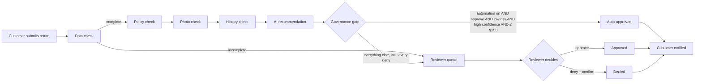
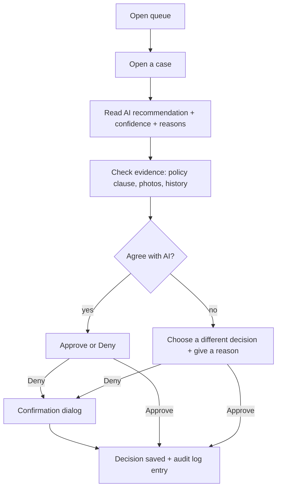

# ReturnGuard — Design Specification

> **Status: v0 (before evidence).** Drafted from the project concept before the prompting
> study and interviews were complete. Every design choice below is traced to the
> complementarity lens (Gonzalez et al., 2026). The **Evidence** column in section 6 is
> filled in after Steps 5–7, and anything the evidence contradicts is revised in v1 — the
> v0 → v1 changes are what Slide 6 presents.

---

## 1. What the product does

A customer returns an item through an online shop. AI checks the return against the store's
policy, the customer's photo, and the customer's history, then recommends approve, deny, or
escalate. A **governance gate** decides what happens next: only clear, low-risk, low-value
cases are approved automatically, and **every denial goes to a human reviewer**.

**Division of labour** (from `validation/THEORY_LENS.md`):

| | AI owns | Humans own |
|---|---|---|
| Reasoning | Applying policy rules consistently; a written rationale for every case | Ambiguous policy calls (wear vs. defect); every denial; accountability |
| Memory | Retrieving the exact policy clause and the customer's history, with sources | Validating that the retrieved evidence actually applies |
| Attention | Checking every return, every photo, every history record | Exceptions the AI flags, and anything that "feels off" |
| Meta-coordination | Routing cases by fixed rules; logging every step | Setting the rules and thresholds; switching automation on or off |

---

## 2. Personas and mental models

### P1 — Maya, the customer
- **Goal:** get a fair refund quickly for a defective item.
- **Mental model:** "A store employee checks my return." Does not expect an AI, and does not
  want to argue with one.
- **Decision rights:** none — submits evidence and receives the outcome.
- **Interrogation moment:** when a decision arrives, wants to know *why* in plain language.
- **Trust cues needed:** a clear status at every stage; a plain-English reason; an explicit
  statement that **a person reviewed** any denial.

### P2 — Riley, the Trust & Safety reviewer
- **Goal:** clear the queue quickly without approving fraud or wrongly denying an honest
  customer.
- **Mental model:** "The AI did the legwork; I make the call." Risk of overtrust (rubber
  stamping) when tired or busy.
- **Decision rights:** **final sign-off on every escalated case and every denial.** Can
  agree with or override the AI.
- **Interrogation moments:** opening a case (what does the AI think, and why?); checking a
  cited policy clause; comparing photos; disagreeing with the AI.
- **Trust cues needed:** confidence shown with its reasons, not just a number; each finding
  linked to its source (policy clause and version, photo, history record); clear warnings
  when evidence is weak or possibly fake.

### P3 — Priya, the risk / platform admin
- **Goal:** keep decisions consistent, policy-compliant, and auditable.
- **Mental model:** "The AI is a junior analyst on probation — it earns autonomy with
  evidence."
- **Decision rights:** turns automation on or off; sets the risk, confidence, and
  high-value thresholds. Cannot change the "AI never denies" rule.
- **Interrogation moment:** auditing a past decision — who or what decided, on what
  evidence, under which policy version.
- **Trust cues needed:** a complete audit trail; how often reviewers agree with the AI.

### Decision rights summary

| Decision | AI | Reviewer | Admin |
|---|---|---|---|
| Recommend approve / deny / escalate | ✅ | — | — |
| Auto-approve a clear, low-risk case ≤ $250 | ✅ only when automation is on | — | — |
| Approve an escalated case | — | ✅ | ✅ |
| Deny any case | ❌ never | ✅ with confirmation | ✅ with confirmation |
| Turn automation on / off, change thresholds | — | — | ✅ |
| Change the "AI never denies" rule | — | — | ❌ fixed |

---

## 3. User journeys and task flows

### 3.1 End-to-end flow



### 3.2 Customer journey — Maya

| Stage | Maya does | Maya sees | Design intent |
|---|---|---|---|
| 1. Shop | Browses, adds sneakers to cart, checks out with a test card | Order confirmation | Realistic context for the return |
| 2. Start return | Opens the order → **Return item** → picks reason, writes note, uploads photo | A photo upload appears only when the reason needs one | Prevents incomplete requests (memory) |
| 3. Wait | — | Status: *Submitted → Being checked → Under review* | Visible progress, no black box |
| 4. Outcome | Reads the decision | Plain-English reason; for denials, "Reviewed by a member of our team" | Trust calibration; accountability |

### 3.3 Reviewer task flow — Riley



### 3.4 Admin task flow — Priya
1. Open **Settings** → see automation status, thresholds, and the reviewer–AI agreement rate.
2. Turn automation on or off, or adjust a threshold → **Save** → change recorded in the
   audit log.
3. Open **Audit log** → filter by case → see every AI step and human action in order.

---

## 4. Screens and wireframes

### 4.1 Customer — Start a return

```
┌──────────────────────────────────────────────────────────┐
│ ShopCo                                    Orders  Cart   │
├──────────────────────────────────────────────────────────┤
│ Return an item — Order #1042                             │
│                                                          │
│ [img] Classic White Leather Sneakers   $89   Delivered   │
│                                              20 Sep 2026 │
│ Reason        [ Damaged / defective          ▼ ]         │
│ Tell us more  [ The sole started peeling away...     ]   │
│                                                          │
│ Photo (required for damaged items)                       │
│ [  Upload a photo  ]                                     │
│                                                          │
│ Refund: $89.00 to the original payment method            │
│                                    [ Submit return ]     │
└──────────────────────────────────────────────────────────┘
```

- The photo field appears only for reasons that need it (damaged, defective, wrong item).
- Submit stays disabled until required fields are complete — the data check starts in the UI.

### 4.2 Customer — Return status

```
┌──────────────────────────────────────────────────────────┐
│ Return #R-208 — Classic White Leather Sneakers           │
│                                                          │
│  ● Submitted ── ● Being checked ── ◐ Under review ── ○ Done
│                                                          │
│ A member of our team is reviewing your return.           │
│ We usually respond within 1 business day.                │
└──────────────────────────────────────────────────────────┘
```

- Progress updates while the AI checks run (polled), so the wait isn't a black box.
- The final message gives the plain-English reason. A denial always says it was reviewed
  by a person and shows the policy rule it was based on.

### 4.3 Reviewer — Queue

```
┌──────────────────────────────────────────────────────────────────┐
│ Review queue (7)        Filter: [ Needs review ▼ ]               │
├──────┬──────────────────────┬────────┬───────────────┬───────────┤
│ Case │ Item                 │ Refund │ AI suggests   │ Why here  │
├──────┼──────────────────────┼────────┼───────────────┼───────────┤
│ R-208│ White Leather Sneaker│ $89    │ Escalate      │ Low conf. │
│ R-211│ Running Shorts       │ $35    │ Deny          │ Denial    │
│ R-214│ Leather Office Chair │ $329   │ Approve       │ High value│
│ R-215│ White Leather Sneaker│ $89    │ — (no photo)  │ Missing   │
└──────┴──────────────────────┴────────┴───────────────┴───────────┘
```

- **"Why here"** tells the reviewer what to focus on before opening the case (attention).

### 4.4 Reviewer — Case page (the core screen)

```
┌──────────────────────────────────────────────────────────────────────┐
│ Case R-208 · Classic White Leather Sneakers · $89 · Jordan Lee       │
├───────────────────────────────────┬──────────────────────────────────┤
│ [AI] RECOMMENDATION               │ EVIDENCE                         │
│ Escalate — Medium confidence (62%)│ Photos                           │
│                                   │ [product photo] [customer photo] │
│ Why not higher:                   │ ⚠ Photo check: shows wear,       │
│ • Photo shows scuffing and creases│   not a clear defect (signal     │
│   — could be normal wear (P3)     │   only)                          │
│ • No clear manufacturing defect   │                                  │
│                                   │ Policy used (version 2)          │
│ Checks                            │ P3. Normal wear and tear ... is  │
│ ✓ Data complete                   │ not a defect ...      [view all] │
│ ✓ Within return window (day 21)   │                                  │
│ ⚠ Photo: wear vs. defect unclear  │ Customer history                 │
│ ✓ History: low risk (2/15 returns)│ Account 2 yrs · 15 orders ·      │
│                                   │ 2 returns · no linked accounts   │
├───────────────────────────────────┴──────────────────────────────────┤
│ Your decision   [ Approve ]   [ Deny… ]                              │
│ Disagree with the AI? Reason (required if you do): [            ]    │
└──────────────────────────────────────────────────────────────────────┘
```

**Trust-calibration cues on this screen**
- **Confidence with reasons:** a band (High / Medium / Low) plus the number, and a "Why not
  higher" list — never a bare score.
- **Provenance:** every finding names its source — the policy clause **and version**, the
  photo, the history record.
- **Signals, not verdicts:** the photo check is labelled "signal only", and a possible
  AI-generated photo gets a distinct warning.
- **AI label:** AI-generated content is marked `[AI]` so the reviewer always knows which
  text came from the model.
- **Disagreement is captured:** overriding the AI requires a short reason, which is logged
  and feeds the agreement rate.

### 4.5 Reviewer — Deny confirmation

```
┌──────────────────────────────────────────────┐
│ Deny this return?                            │
│                                              │
│ Case R-211 · Running Shorts · $35            │
│ Policy basis: P1 — outside the return window │
│ (delivered 15 Aug, day 47)                   │
│                                              │
│ The customer will be told this decision was  │
│ made by a person.                            │
│                                              │
│            [ Cancel ]   [ Confirm denial ]   │
└──────────────────────────────────────────────┘
```

- A denial is never one accidental click. The dialog restates the case and the policy basis
  so the reviewer re-checks rather than rubber-stamps.

### 4.6 Admin — Settings

```
┌──────────────────────────────────────────────────────────┐
│ Automation settings                                      │
│                                                          │
│ Automatic approvals      ( ) Off   (•) On                │
│ Risk must be below       [ 0.30 ]                        │
│ Confidence must be above [ 0.80 ]                        │
│ Refunds above this always need a person  [ $250 ]        │
│                                                          │
│ 🔒 The AI can never deny a return. (Not configurable.)   │
│                                                          │
│ Reviewer agreed with AI: 87% of last 50 decisions        │
│                                         [ Save changes ] │
└──────────────────────────────────────────────────────────┘
```

- The locked rule is shown, not hidden, so the admin's mental model of the system is
  accurate.
- The agreement rate sits next to the switch: evidence for turning automation on or off.

### 4.7 Admin — Audit log
A filterable table: time · actor (AI step / reviewer / admin) · action · case · details.
Opening a case shows its full history in order: each AI step's result, the gate's routing,
and the human decision.

---

## 5. Design system alignment — IBM Carbon

We follow **[IBM Carbon](https://carbondesignsystem.com/)**: it is built for data-heavy
enterprise tools like the reviewer dashboard, and its AI guidance covers labelling
AI-generated content and explaining it.

| Need | Carbon pattern | Where we use it |
|---|---|---|
| Mark AI output | AI label + explainability popover | `[AI]` badge on the recommendation; "Why" opens the reasons |
| Review queue | Data table with filters and status tags | Reviewer queue (4.3), audit log (4.7) |
| Risky, irreversible action | Danger modal with explicit confirmation | Deny confirmation (4.5) |
| Status of a return | Progress indicator | Customer status (4.2) |
| Warnings about weak evidence | Inline notification (warning) | Photo and evidence warnings (4.4) |
| Settings | Toggle, number input, read-only field | Admin settings (4.6) |

The shop pages keep a simpler, consumer-friendly look; Carbon applies to the reviewer and
admin screens.

---

## 6. Traceability — every UI choice back to theory (and evidence)

| UI choice | Pillar / principle (Gonzalez et al., 2026) | Evidence (filled after Steps 5–7) |
|---|---|---|
| Every denial goes to a reviewer; AI can't deny | Meta-coordination; **role partitioning** | Prompting F3; interviews (safety) |
| Deny confirmation dialog restating the policy basis | Reasoning — human ethical authority; guards against rubber-stamping | |
| Confidence band + "Why not higher" list | **Attention & interrogation orchestration** — confidence thresholds, interrogation | Prompting E1 (consistency, overconfidence) |
| Policy clause and version shown with every finding | Memory — provenance; **knowledge infrastructure** | |
| Photo check labelled "signal only"; synthetic-photo warning | Attention — AI misses "unknown unknowns"; humans handle exceptions | Prompting F1 |
| "Why here" column in the queue | Attention orchestration — directs limited reviewer attention | |
| Data check: photo required before submit; incomplete cases escalate | Memory — don't guess past missing information | Prompting F2 |
| Override requires a reason; agreement rate shown | **Training & evaluation** — learning from disagreement | |
| Automation switch + thresholds only an admin can change | **Goals & constraints**; meta-coordination | |
| Customer told a person reviewed any denial | Trust calibration; accountability | Interviews (customer) |

**Design principle we commit to:** attention & interrogation orchestration — confidence
thresholds and escalation rules decide when the AI defers to a human, and the case page is
built for interrogating the AI's reasoning.

---

## 7. Out of scope for this spec

Appeals, reviewer follow-up questions to customers, multiple automation levels, fraud-ring
visualizations, and analytics beyond the agreement rate.
