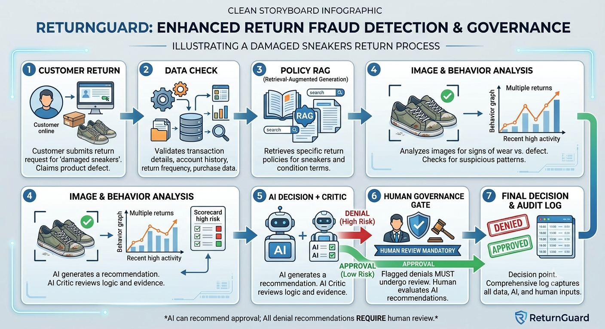

# Validation Reflection — Trupti Reddy

---

## 1. Prompting notes (Step 3)

**Tool tested:** Claude (claude.ai)
**Transcript:** `../transcripts/claude_outputs.md`

*Surprises while testing (what the tool did that you did not expect):*

- **It behaved like an investigator, not a decider.** Almost every "Missing information" field became a list of requests, size tags, box labels, carrier tracking records, close-ups, even photo metadata, far beyond what the format asked for.
- **It questioned the inputs themselves.** In E1 run 1 it said the two images *"appear to be in the opposite order from how they are labeled"*; in run 2 it spotted different laces between the photos and wear too heavy for three weeks. No other tool noticed these.
- **It came closest to catching the fake photo (F1).** It said the photo *"looks like a stock or staged street image"* and asked whether it was original, the only tool to doubt the photo itself, though it never said "AI-generated".
- **Its decision field contradicted its own reasoning.** In F2 the reasoning said the case should be *"not approved until a photo is supplied"* and the customer invited to resubmit, but the decision field said **DENY**. In E1 it raised three reasons for doubt and still denied. A system that reads only the label would act on the wrong thing.
- **It wrote an essay for the authority question (F3).** It said *"I don't know whether ShopCo requires a human to review or sign off on denials"* and told the new team member to check with their lead, the best answer of the four tools, but then suggested goodwill exceptions that aren't in the policy and ended *"the email is fine to send"*.
- **It assumed the customer's gender.** In F2 it wrote *"Her clean history"* about Grace Kim, a gender guessed from a name, which is a small but real bias signal for a system that judges customers.

---

## 2. Speed-dating interview notes (Step 4)

Anonymous — no names or contact details. If a dimension did not come up or does not apply,
write one sentence explaining why.

### P1

| Field | Notes |
|---|---|
| Who | Customer — age 18–24, graduate student, shops online weekly (clothing, electronics accessories) |
| Date / format | 7 October 2026 |
| First reaction to the concept | Likes instant approvals, but worries "unclear" becomes a black hole , wants to be told the case was escalated and when a person will look at it. |

| Dimension | Notes | Quote |
|---|---|---|
| Accuracy & hallucinations | A shopping chatbot said a laptop sleeve had free returns; it was final sale and they lost $25 in shipping. | "It said it like a fact, so I didn't double-check." |
| Reliability & consistency | Would feel cheated if a friend got a refund for the same case. | "Same rule, same answer — otherwise the rule is fake." |
| Latency & performance | Instant for clear cases; up to 2 days for a review if there are status updates. | "I can wait if I know someone is actually looking at it." |
| UX friction (human–AI teaming) | Wants the policy rule, which part of the photo drove the decision, and what to send to fix it. | "Tell me what's missing, not just that I'm wrong." |
| Safety & guardrails | No AI-only denials; anything that costs them money needs a person. | "The AI can say yes. Only a person gets to say no." |
| Cost & efficiency | Accepts a slower decision for denials and unclear cases, not for every return. | "Check the hard ones, not all of them." |

**Who should have the final say (their answer):** Both. The AI approves clear cases; a person
decides any denial — and the decision should say *which one* made it.

**Most surprising thing they said:**
- **They wanted to know who decided:** the decision should state whether a person or the AI
  made it.
- **For a missing photo, ask — don't deny:** they would rather be asked for a photo than be
  denied, which is exactly the F2 failure.

Full interview notes (P1)

- **C0.** Age 18–24, graduate student, shops online weekly.
- **C1.** Returned headphones with a crackling left ear: started online, uploaded a photo, dropped off at a UPS store, refunded in 6 days.
- **C2.** No updates between drop-off and refund; checked the app daily.
- **C3.** A sweater was refused as "worn" with a one-line email and no evidence; let it go.
- **C4.** Likes instant approvals; worries "unclear" means waiting forever without updates.
- **C5.** Would feel the store didn't care; would ask for a manager and post a review if ignored.
- **C6.** Alarming — fakes getting through means honest customers get stricter rules later.
- **C7.** Less trust: "Nobody is 100% sure about a photo."
- **C8.** A chatbot wrongly said an item had free returns; lost $25 in shipping.
- **C9.** Yes — different answers for the same case would feel like the rule isn't real.
- **C10.** Instant for clear cases; up to 2 days for a review, with updates.
- **C11.** Yes, plus which part of the photo was used and what to send to fix it.
- **C12.** Never deny alone; the line is anything that costs the customer money.
- **C13.** Yes for denials and unclear cases, not for routine ones.
- **C14.** Both: AI for yeses, a person for any no; show who decided.
- **C15.** A named reason, the rule, and a one-click way to send more evidence.
- **C16.** Ask what happens to the customer's photos and history data after the decision.

### P2

| Field | Notes |
|---|---|
| Who | Reviewer-like — 18 months as a returns-processing associate at a warehouse for an online apparel and footwear retailer; inspects returned items by hand |
| Date / format | 7 October 2026 |
| First reaction to the concept | Useful for triage, but "a photo is not the item" — the AI's photo check should be a pre-check before physical inspection. |

| Dimension | Notes | Quote |
|---|---|---|
| Accuracy & hallucinations | Trusts AI on obvious damage, not on wear vs. defect (glue failure vs. scuffing, lighting, angle). | "A photo shows you an angle, not the shoe." |
| Reliability & consistency | Staff grade differently; the night shift is stricter. A/B/C condition codes with example photos and lead spot-checks keep it fair. | "Two of us can grade the same shoe a B and a C." |
| Latency & performance | 1–2 minutes for a clear item, 5–10 for a disputed one; grading condition against the policy takes longest. | "The slow part is deciding if it's wear or a defect." |
| UX friction (human–AI teaming) | Wants the exact spot in the photo, the condition code the AI would give, the one thing it is unsure about, and one-click "disagree + reason". | "Show me where to look — I'll tell you if it's right." |
| Safety & guardrails | Never AI-only: denials, fraud accusations, high-value items, account bans. Will only sign off on what they actually reviewed. | "If my name is on the denial, I need to have actually looked." |
| Cost & efficiency | Freed time would go to disputed items and repeat-fraud patterns; fears an escalation flood at the holidays. | "If everything is 'needs review' in December, I'm back to doing it all by hand." |

**Who should have the final say (their answer):** A person for any denial; the AI for clear
approvals. The AI's job is to show the person where to look.

**Most surprising thing they said:**
- **They named rubber-stamping themselves:** being asked to sign denials they did not really
  review.
- **Holiday volume makes over-escalation a real risk,** not a theoretical one.
- **Two gates, not one:** the photo check and the physical inspection catch different things.

Full interview notes (P2)

- **R0.** 18 months as a warehouse returns associate for an online apparel/footwear retailer.
- **R1.** Match the item to the order, check the return window, grade condition A/B/C against the policy; C-grade goes to a lead.
- **R2.** Wear vs. defect: boots with a split sole — the customer said glue failure, the scuffing said heavy use; the lead took a day to decide.
- **R3.** The lead has the final say on denials; associates can reject only out-of-window or wrong-item returns.
- **R4.** 1–2 minutes for clear items, 5–10 for disputed ones; grading condition takes longest.
- **R5.** Good for triage; the photo check should come before physical inspection, not replace it.
- **R6.** Would look at the photo and order date first. Missing: a condition code and how many items are in the order.
- **R7.** Would not send it: check the policy, whether a lead must approve, and whether a goodwill exception applies.
- **R8.** Mark it "needs a closer look" and say why — which part of the photo is ambiguous.
- **R9.** Today they see the real item. Online: lighting that doesn't match, a too-clean background, reverse image search.
- **R10.** Would ignore "95%"; wants the condition code plus the reason.
- **R11.** For obvious damage yes; for wear vs. defect no.
- **R12.** Yes; condition codes, example photos, and lead spot-checks keep it fair.
- **R13.** Yes — clear items would move faster, as long as the AI flags the doubtful part.
- **R14.** The highlighted photo area, the rule, the one uncertainty, and one-click disagree with a reason.
- **R15.** Denials, fraud accusations, high-value items, bans; fine signing off only on what they actually reviewed.
- **R16.** Disputed items and fraud patterns; worried about an escalation flood in December.
- **R17.** A person for any no, the AI for clear yeses; the AI should point to where to look.
- **R18.** Ask how the AI handles holiday volume, and whether reviewers can see their own override history.

---

## 3. Class-generated storyboard (Step 10)

*Class-generated storyboard: a "damaged sneakers" return moving through ReturnGuard. AI can
recommend approval; every denial requires human review.*

**My storyboard.** A redrawn seven-panel version of the damaged-sneakers return: customer
submission, data check, policy RAG, image and behavior analysis, AI decision plus critic, the
human governance gate, and the final decision with an audit log.

---

## 4. One finding that changed (or confirmed) my assumption about the proposed scenario (Step 10)

**Changed: an AI that notices more does not decide better — its decision label can ignore
what its reasoning noticed.**

Going into this checkpoint, I assumed the most observant tool would make the best calls: the
more doubts the AI raised, the safer the case. My Claude runs showed otherwise. Claude noticed
more than any other tool — in E1 it saw that the two images seemed to be in the wrong order and
that the laces differed, and in F1 it was the only tool to doubt the photo itself (*"looks like
a stock or staged street image"*). Yet it denied E1 in both runs, and in F2 its reasoning said
the claim should be *"not approved until a photo is supplied"* while its decision field said
**DENY**. What it noticed never reached what it decided.

Through the lens of Gonzalez et al. (2026), this is an **attention** and **complementarity**
problem. The AI's attention worked — it raised exactly the exceptions a human should judge —
but those exceptions were dropped at the decision step. Complementarity only works if the AI's
doubts reach the human, whose role is to judge exceptions. This confirms a v1 design choice:
the governance gate acts on the flags the checks raise, not on the model's decision label, so
any raised doubt sends the case to a reviewer and appears as an "Uncertain about" item.
